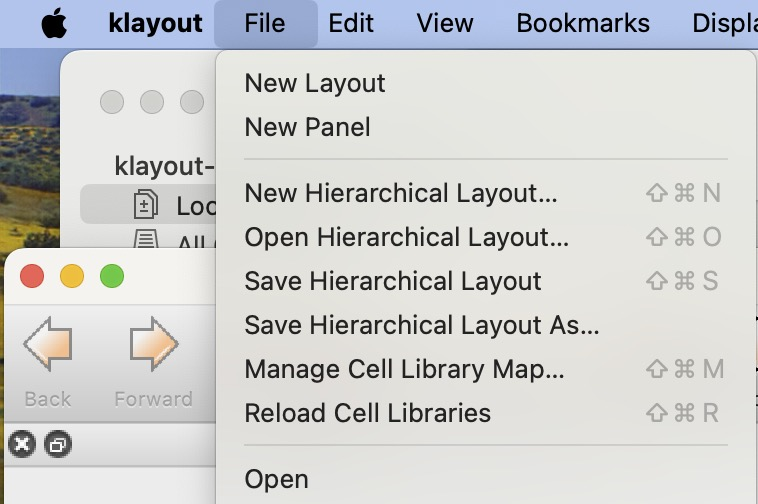
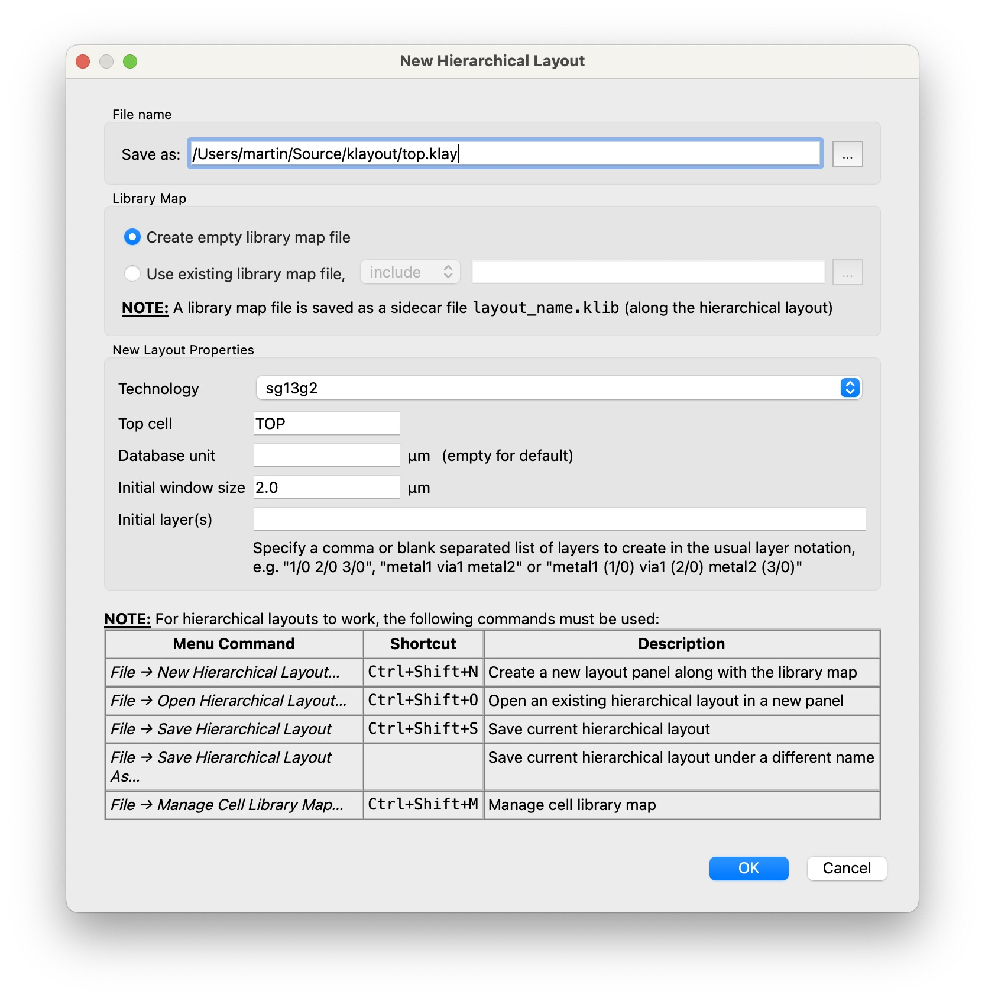
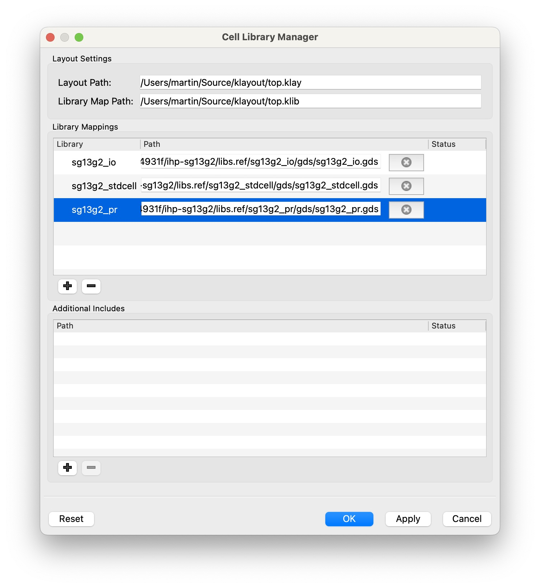

# KLayout Plugin: Library Manager for Hierarchical Layouts

<!--

-->

* Boost your layout productivity with hierarchical layouts
   
This add-on can be installed through [KLayout](https://klayout.de) package manager, [see installation instructions here](#installation-instructions)

## Usage

### Basics

- Hierarchical layouts have suffix `*.klay` (and are technically OASIS files with special metadata)
- A library is just a Layout, with its top cells representing library cells
- Library maps have suffix `*.klib` (and are basically JSON files with a special schema), they can contain
   1. Comments
   2. Library Definition: maps a name to a library path (e.g. a stdcell library)
   3. Library Map Includes: reference to include another `*.klib` file (e.g. a set of libraries useful for the PDK)
- **NOTE:** alternatively to this plugin, you could also put them in `~/.klayout/libraries/`

### Menu Commands 

1. In the *File* Menu, there are commands related to the library manager:

2. Use *File*→*New Hierarchical Layout…* to configure a new hierarchical layout:

3. With a Hierarchical Layout open, use *File*→*Manage Cell Library Map…* to manage the cell libraries:

4. With a Hierarchical Layout open, use *File*→*Save Hierarchical Layout [As]…* to save the layout.

## Installation using KLayout Package Manager

1. From the main menu, click *Tools*→*Manage Packages* to open the package manager
2. Locate the `LibraryManagerPlugin`, double-click it to select for installation, then click *Apply*
3. Review and close the package installation report
4. (If needed,) confirm macro execution
